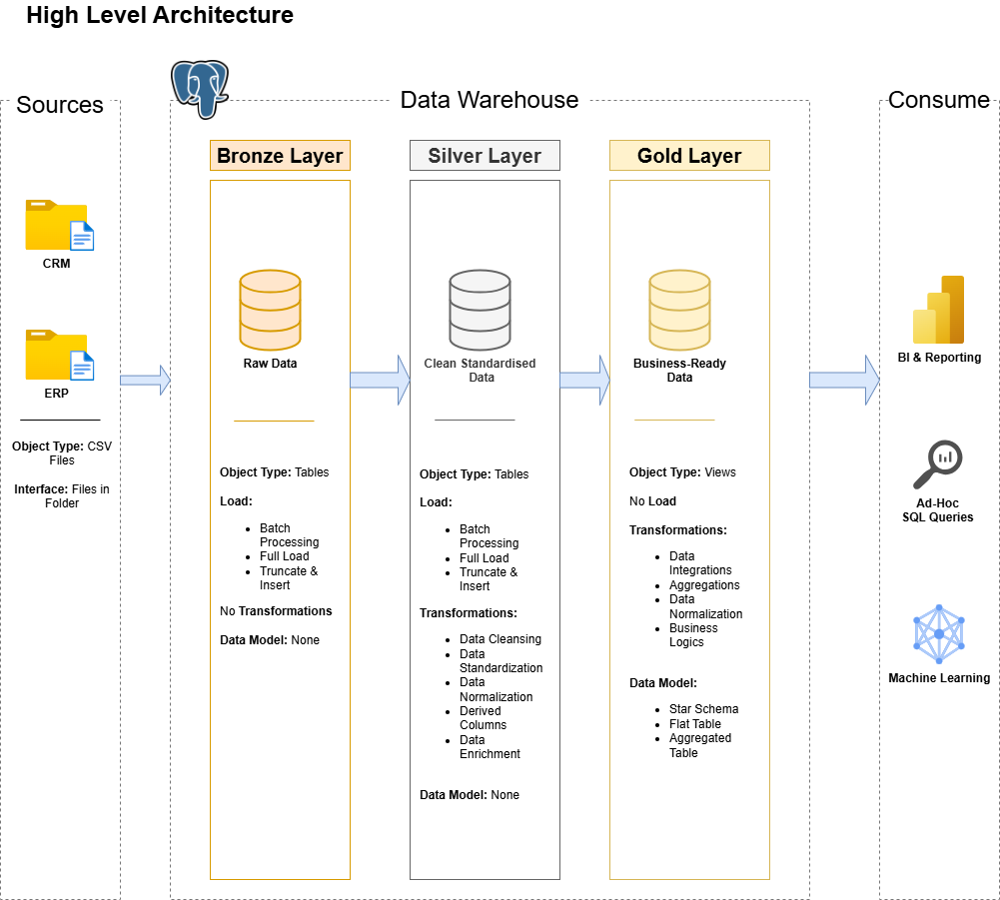

# Data Warehouse and Analytics Project
>> (Data with Baraa tutorial project)

---
Building a modern data warehouse with PostgreSQL, including ETL processes and data modeling.

---
## Data Architecture

The data architecture for this project follows Medallion Architecture **Bronze**, **Silver**, and **Gold** layers:


1. **Bronze Layer**: Stores raw data as-is from the source systems. Data is ingested from CSV Files into SQL Server Database.
2. **Silver Layer**: This layer includes data cleansing, standardization, and normalization processes to prepare data for analysis.
3. **Gold Layer**: Houses business-ready data modeled into a star schema required for reporting and analytics.

---
## Project Overview

This project involves:

1. **Data Architecture**: Designing a Modern Data Warehouse Using Medallion Architecture **Bronze**, **Silver**, and **Gold** layers.
2. **ETL Pipelines**: Extracting, transforming, and loading data from source systems into the warehouse.
3. **Data Modeling**: Developing fact and dimension tables optimized for analytical queries.

---
## Important Links:
- **[Project Tutorial by Data with Baraa ]([https://youtu.be/9GVqKuTVANE?si=92xzIcUVPdrVva3J]):** SQL Data Warehouse from Scratch | Full Hands-On Data Engineering Project

---

## 📂 Repository Structure
```
sql-data-warehouse/
│
├── datasets/                           # Raw datasets used for the project (ERP and CRM data)
│
├── docs/                               # Project documentation and architecture details
│   ├── architecture_diagram.png        # Shows the project's architecture
│   ├── data_catalog.md                 # Catalog of datasets, including field descriptions and metadata
│   ├── data_flow_diagram.png           # Shows the data flow
│   ├── data_model.png                  # Shows the data model (star schema)
│   ├── integration_model.png           
│
├── scripts/                            # SQL scripts for ETL and transformations
│   ├── bronze/                         # Scripts for extracting and loading raw data
│   ├── silver/                         # Scripts for cleaning and transforming data
│   ├── gold/                           # Scripts for creating analytical models
│
├── tests/                              # Test scripts and quality files
│
├── README.md                           # Project overview and instructions
```

---
## License

This project is licensed under the [MIT License](LICENSE). You are free to use, modify, and share this project with proper attribution.
